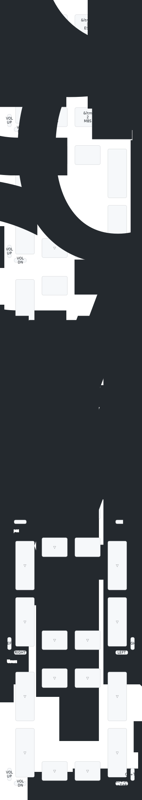

## Endgame Trackball (firmware)

### Prerequisites
1. Git
2. Protobuf
3. Zephyr SDK
4. West

### Building

#### Locally
1. `git submodule update --init --recursive`
2. `cd zmk/`
3. `west init -l app`
4. `west update`

Now, staying in the `zmk` directory, build with west:
```shell
west build --pristine always -s app -b efogtech_trackball_0 -S studio-rpc-usb-uart -S zmk-usb-logging -- -DZMK_EXTRA_MODULES="$(pwd)/../endgame-trackball-config;$(pwd)/../zmk-pmw3610-driver;$(pwd)/../zmk-paw3395-driver;$(pwd)/../zmk-pointer-2s-mixer;$(pwd)/../zmk-axis-clamper;$(pwd)/../zmk-report-rate-limit;$(pwd)/../zmk-ec11-ish-driver;$(pwd)/../zmk-auto-hold;$(pwd)/../zmk-behavior-follower;$(pwd)/../zmk-keymap-shell;$(pwd)/../zmk-acceleration-curves;$(pwd)/../zmk-rotate-plane;$(pwd)/../zmk-runtime-config;$(pwd)/../zmk-adaptive-feedback;$(pwd)/../zmk-bistable-behavior;$(pwd)/../zmk-ble-shell;$(pwd)/../zmk-esb-endpoint;$(pwd)/../zmk-feedback-common" -DCONFIG_ZMK_STUDIO=y -DZMK_CONFIG="$(pwd)/../endgame-trackball-config/config"
```

Look for `build/zephyr/zmk.uf2` — it's your firmware.

### Keymap Visualization

Generated layout docs are committed under `docs/generated/`.

- Regenerate YAML + SVG: `make keymap-svg`
- Canonical rendered keymap: [`docs/generated/efogtech_trackball_0.svg`](docs/generated/efogtech_trackball_0.svg)



#### Layer guide

| Layer | How to reach it | Purpose / non-obvious bindings |
|-------|-----------------|--------------------------------|
| Default | Normal layer | Main button map. `&mkp` entries are mouse clicks: `LCLK`, `MCLK`, `RCLK`, `MB4`, `MB5`. Encoders handle volume and Ctrl+Tab / Ctrl+Shift+Tab. |
| Extras | Hold bottom-left button (`MB4` on tap) | Clipboard helpers: copy, paste, cut, undo. |
| Device | Hold bottom-right button (`MB5` on tap) | Bluetooth/profile controls, adaptive feedback toggle, bistable toggle, and ZMK Studio unlock. |
| Scroll | Hold top-right button (`Esc` on tap), or hold the click/double-click/hold button | Trackball becomes scroll input. Buttons adjust pointer/scroll sensitivity and report-rate limit. |
| Snipe | Hold top-left button (`Enter` on tap) | Slower precision pointer mode. Encoder directions become left/right arrows. |
| User | Not bound from Default | Spare layer for local customization. |

ZMK shorthand used above: `&ltmkp LAYER KEY` = hold layer / tap keyboard key; `&ltm LAYER BTN` = hold layer / tap mouse button; `&cdch LAYER 0` = hold layer, tap copy, double-tap paste; `&trans` = fall through to the lower layer; `&sens`, `&scrlsens`, and `&rrl` tune pointer/scroll/report-rate behavior.

#### Locally, via Docker

First time:

```sh
git submodule update --init --recursive
mkdir -p output
docker build -t endgame-firmware .
```

Building:

```sh
docker run --rm -v "$(pwd):/workspace" -v "$(pwd)/output:/output" endgame-firmware
```

You can customize the building process by copying `build_trackball.sh` to `build_trackball_local.sh` and tweak that as needed.

If you ever need to re-run `west init -l app && west update`, just run `rm -rf zmk/.west` then re-build docker with `docker build -t endgame-firmware .`

#### GitHub Actions
Fork the `endgame-trackball-config` repository. Any commit will trigger an action that will build the firmware for you.

### Troubleshooting

1. Flash the [debug firmware](https://github.com/efogtech/endgame-trackball-config/tree/debug).
2. [Check out your logs](https://zmk.dev/docs/development/usb-logging#viewing-logs) via USB.

### Also see
1. Parent repo: https://github.com/efogtech/endgame-trackball
2. ZMK docs: https://zmk.dev/docs/
3. Zephyr 3.5 docs: https://docs.zephyrproject.org/3.5.0/
